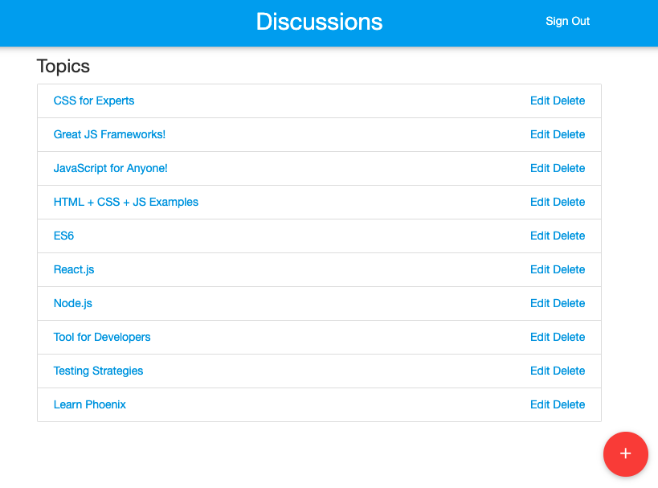

# Discuss

To start your Phoenix app:

- Install dependencies with `mix deps.get`
- Create and migrate your database with `mix ecto.create && mix ecto.migrate`
- Install Node.js dependencies with `npm install`
- Start Phoenix endpoint with `mix phoenix.server`

Now you can visit [`localhost:4000`](http://localhost:4000) from your browser.


# Cards

## Installation

If [available in Hex](https://hex.pm/docs/publish), the package can be installed
by adding `cards` to your list of dependencies in `mix.exs`:

```elixir
def deps do
  [
    {:cards, "~> 0.1.0"}
  ]
end
```

# Identicon

## Installation

If [available in Hex](https://hex.pm/docs/publish), the package can be installed
by adding `identicon` to your list of dependencies in `mix.exs`:

```elixir
def deps do
  [
    {:identicon, "~> 0.1.0"}
  ]
end
```

Documentation can be generated with [ExDoc](https://github.com/elixir-lang/ex_doc)
and published on [HexDocs](https://hexdocs.pm). Once published, the docs can
be found at [https://hexdocs.pm/identicon](https://hexdocs.pm/identicon).
